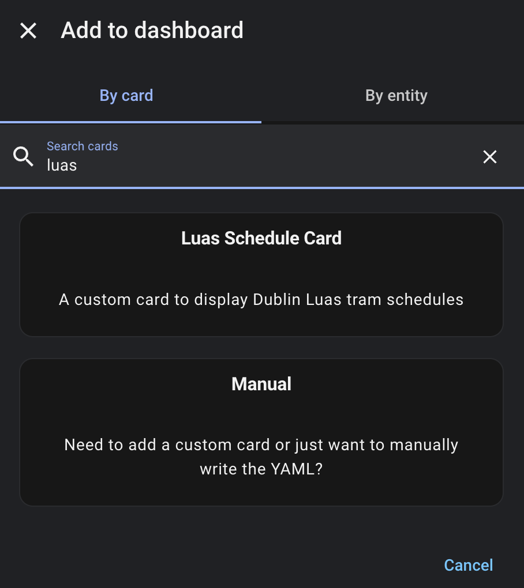
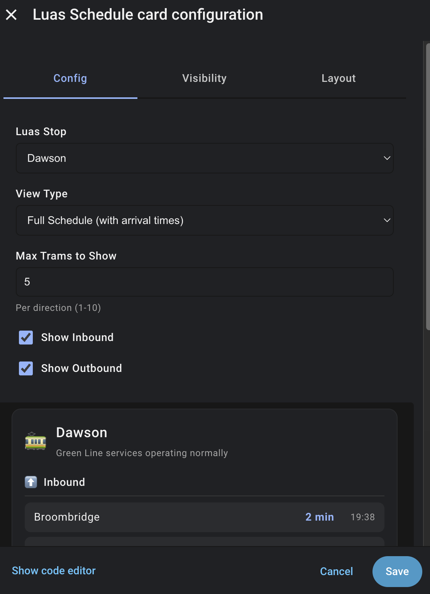
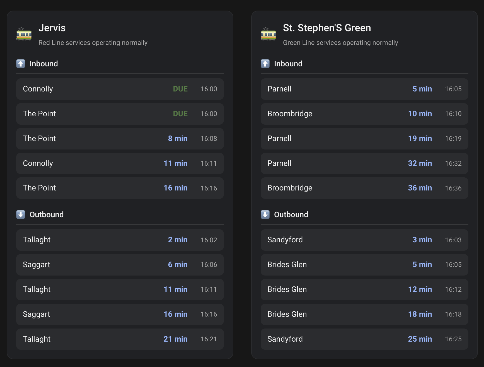

# Dublin Luas Schedule Card

This is a custom Lovelace card for Home Assistant, designed to work seamlessly with the [Dublin Luas Schedule integration](https://github.com/william88987/dublin-luas-schedule-hacs).

## Installation via HACS

1. Make sure HACS is installed.
2. Go to HACS -> Frontend.
3. Add this repository as a custom repository (Category: Lovelace).
4. Install "Dublin Luas Schedule Card".
5. Add the resource `/hacsfiles/dublin_luas_schedule_card/luas-schedule-card.js` to your Lovelace configuration.

## Manual Installation

1. Download `luas-schedule-card.js` and place it in your Home Assistant's `www` folder (e.g., `/config/www/luas-schedule-card.js`).
2. Add the following to your Lovelace resources list in Home Assistant:
   ```yaml
   url: /local/luas-schedule-card.js
   type: module
   ```

## Usage

Use the card in your dashboard as follows:

```yaml
type: custom:luas-schedule-card
entity: sensor.luas_<stop_name>
```




